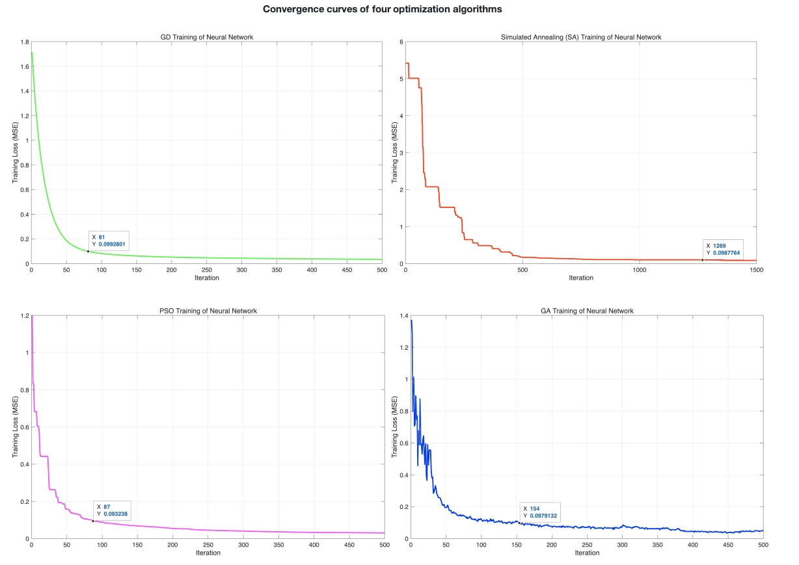
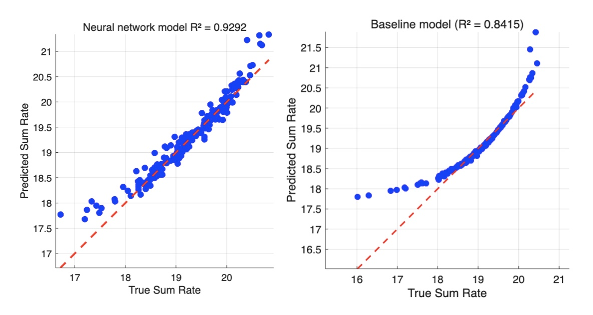
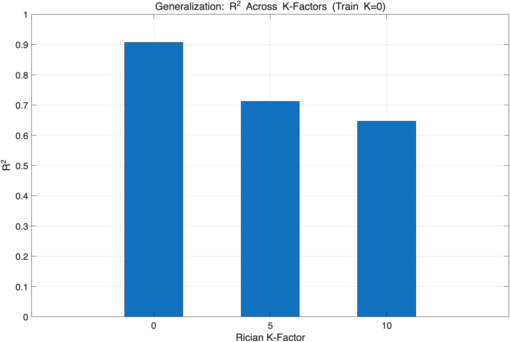

## Optimization Algorithms for Training Neural Networks in RIS Systems

This repository contains a complete learning-based pipeline for modeling and analyzing reconfigurable intelligent surface (RIS)–assisted wireless channels.  
The project evaluates optimization algorithms, neural network model performance, and generalization behaviour under different RIS channel distributions.  
Work conducted under supervision of Prof. Ender Ayanoglu (UC Irvine).
## Motivation

RIS-assisted channels are highly nonlinear and high-dimensional due to the cascaded Tx–RIS–Rx propagation and phase configuration. Direct analytical evaluation is expensive, so fast and accurate neural-network surrogate models are valuable for system design.  
This project studies:  
how different training algorithms behave,  
how well a neural predictor models RIS-assisted sum-rate,  
and how the model generalizes under distribution shift (Rayleigh → Rician, K=0/5/10).


## Experiments & Results

### 1. Optimization Algorithm Benchmarking (GD / GA / PSO / SA)
**Goal:** Compare convergence speed and robustness when training the same neural network on RIS-generated data.  

<p align="center">
  
</p>

<p align="center">
  <b>Figure 1.</b> Convergence curves of four optimization algorithms.
</p>

**Performance Metrics Summary**
| Algorithm | Epochs (Loss < 0.1) | Robustness (Std of Final 50 Losses) |
|------------|---------------------|-------------------------------------|
| **Gradient Descent (GD)** | **81** | **0.000515** |
| Particle Swarm Optimization (PSO) | 87 | 0.001067 |
| Genetic Algorithm (GA) | 154 | 0.003393 |
| Simulated Annealing (SA) | 1269 | 0.000000 |

**Finding:**  
Gradient Descent (GD) converges the fastest and remains highly stable.  
PSO also reaches low loss with moderate stability, while GA shows larger fluctuations during training.  
SA is numerically stable but requires far more iterations to achieve comparable loss levels.

---

### 2. Neural Network vs Baseline Model Performance
**Goal:** Train a GD-optimized NN to predict RIS-assisted sum-rate and compare with a baseline.  


<p align="center">
  
</p>
<p align="center">
  <b>Figure 2.</b> Predicted vs. True Sum Rate for the neural network and baseline models.<br>
  (a) Neural network model (R² = 0.9292)  (b) Baseline model (R² = 0.8415)         
</p>

**Performance Metrics Summary**
| Model | MSE | RMSE | MAE | R² |
|--------|------|------|------|------|
| Linear Regression (Baseline) | 0.0885 | 0.2974 | 0.1532 | 0.8415 |
| **Neural Network (Optimized)** | **0.0385** | **0.1962** | **0.1250** | **0.9292** |


**Finding:**  
NN reduces MSE by more than 50%.  
R² improves from 0.84 → 0.93 (+10%).  
NN captures nonlinear RIS-related behaviours more effectively.

---


### 3. Generalization Under K-Factor Shift (K = 0 / 5 / 10)

**Goal:** Evaluate the trained NN when channel distribution shifts from Rayleigh (K=0) to Rician (K=5,10).
<p align="center">
  
</p>

<p align="center">
  <b>Figure 3.</b> R² across Rician K-factors (train K=0).
</p>

**Performance Metrics Summary**
| K  |   R²      |   RMSE    |   MAE    |
|----|-----------|-----------|----------|
| 0  | 0.90718   | 0.23323   | 0.13178  |
| 5  | 0.71200   | 0.64977   | 0.38024  |
| 10 | 0.64663   | 0.83075   | 0.50403  |

**Finding:**  
NN performs well on the training distribution (K=0).  
Performance drops significantly at K=5 and K=10.  
This reflects the mismatch between the random Rayleigh training data and the more deterministic LOS components in Rician fading.

## Code Structure
```
├── ris_baseline.m                 # Linear regression baseline model training and evaluation
├── ris_nn_final.m                 # Neural network training with GD + generalization (K=0,5,10)
├── convergence_curves.png         # Convergence curves of four optimization algorithms
├── r2_comparison.png              # Predicted vs. True Sum Rate comparison (Baseline vs. NN)
├── generalization_r2_k0_k5_k10.png # R² across Rician K-factors (generalization test)
├── README.md                      # Project documentation
└── LICENSE                        # License file
```
## Reproduction

The project can be reproduced using MATLAB R2025b or later.

### Step 1. Clone the repository
```bash
git clone https://github.com/yazhexu/learning-based-ris-optimization.git
cd learning-based-ris-optimization
```
### Step 2. Run in MATLAB
```
% Baseline (linear regression)
ris_baseline;

% Neural network training with GD + generalization (K=0,5,10)
ris_nn_final;
```
### Step 3. Outputs

- `baseline_performance.png` — Predicted vs. true sum rate (baseline)
- `nn_performance.png` — Predicted vs. true sum rate (neural network)
- `generalization_r2_k0_k5_k10.png` — R² across Rician K-factors (generalization)
- Key metrics (MSE, RMSE, MAE, R²) printed in the MATLAB command window

## Author & Acknowledgment

Developed by **Yazhe Xu**, University of California, Irvine (UCI).  
Supervised by **Prof. Ender Ayanoglu**.  

This repository is part of ongoing research on algorithmic optimization and learning-based modeling in Reconfigurable Intelligent Surface (RIS) communication systems.  
All code and figures are provided for academic and research purposes.

